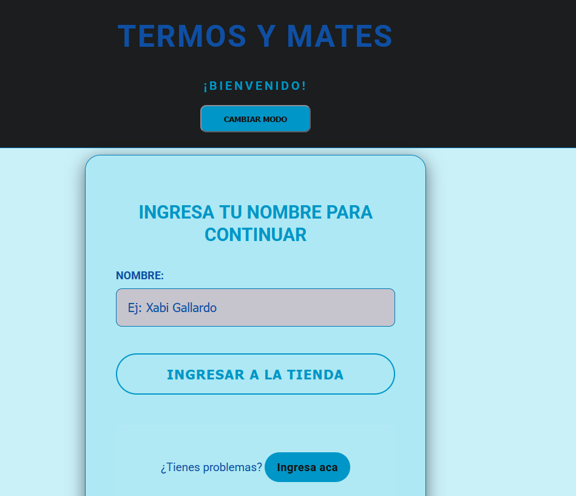
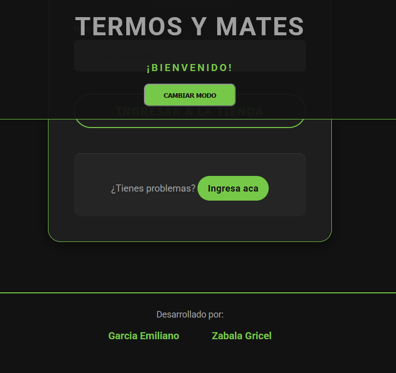
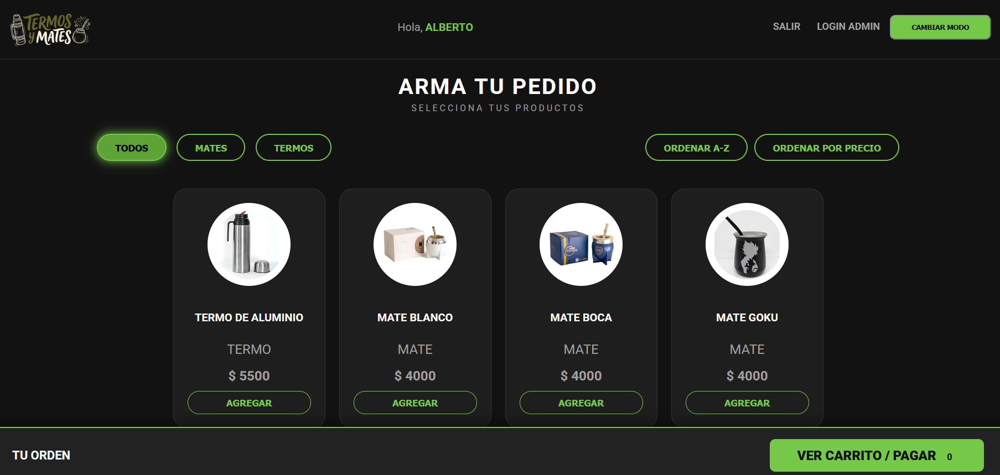
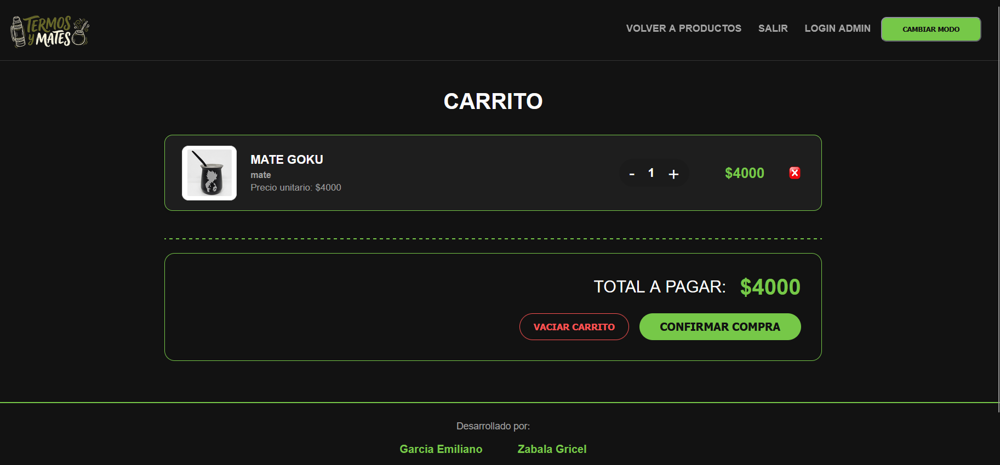
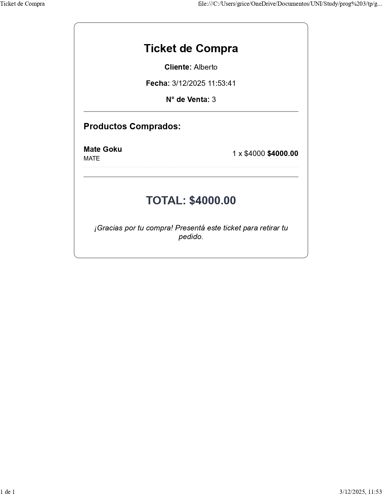

# Trabajo práctico | Segundo parcial
## División 132 Programación III, UTN Facultad Regional Avellaneda, Tecnicatura Universitaria en Programación
### Equipo de Emiliano García y Gricel Díaz Zabala

---

# Tienda de termos y mates

En esta tienda virtual se venden distintos tipos de termos y mates.
Para ingresar a la tienda **como cliente** debes ingresar tu nombre en el Log In, luego pasarás a la pantalla de productos donde podrás ver todos los productos disponibles y agregarlos a tu carrito, también se pueden ordenar los productos en de manera descendente por precio o alfabética, y ya que tenemos dos tipos de productos (termos y mates), podés elegir ver sólo mates o sólo termos (y éstos a su vez, ordenarlos también).

En cambio, para entrar como **administrador**, apretás en LogIn Admin y ahí tendrás que ingresar usuario y claves válidas (guardadas en bases de datos locales).
Para mayor seguridad, las claves de usuarios están *hasheadas*, esto signfica que es más difícil para alguien externo al sistema, descifrar las claves, como si estuvieran protegidas.

*Está la opción de poner modo oscuro o claro*

Aquí se muestra la pantalla "index", donde están los productos y funciones principales:

Luego de agregar al carrito avanzamos al carrito:

Y finalmente podemos imprimir un ticket de nuestra compra:

